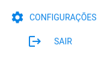

# AlertaMe

- É um sistema composto por duas formas de interação (_website e Alexa_), com o objetivo de alertar o usuário por meio de notificações através da assistente virtual Alexa️.

- Tem como público alvo pessoas idosas e seus cuidadores.

- O registro dos lembretes é essencial, pois permite que a Alexa envie notificações ao usuário.

- A pessoa cuidadora utiliza o website para gerenciar os lembretes, enquanto a pessoa idosa interage com o sistema por meio da Alexa. Para isso, é necessário que a pessoa idosa conceda autorização à pessoa cuidadora.

- É possível gerar o histórico dos lembretes, tanto para visualização no website quanto para fins de exportação.

### Sumário :receipt:

- [Criação de conta](#criação-de-conta-floppy_disk)
- [Autorização](#autorização-unlock)
- [Tipos de lembretes](#tipos-de-lembretes-memo)
  - [Lembretes de medicamentos](#lembretes-de-medicamentos-medical_symbol)
  - [Lembretes de água](#lembretes-de-água-droplet)
  - [Lembretes de consulta médica](#lembretes-de-consulta-médica-stethoscope)
- [Notificações](#notificações-bell)
- [Histórico](#histórico-chart_with_upwards_trend)
- [Sobre o desenvolvimento](#sobre-o-desenvolvimento-man_technologist)

#### Criação de conta :floppy_disk:

O processo de criação de conta é feito assim que o usuário realizar o login pela primeira vez.
O login é feito usando uma conta Google existente, e o email da pessoa idosa pode ser diferente do email da pessoa cuidadora.

> **Pessoa Idosa**
> É necessário acessar o aplicativo da Alexa e instalar a skill _AlertaMeSkill_, é através dessa skill que a Alexa irá se conectar ao website e consultar os lembretes associados a conta da pessoa idosa.

> **Pessoa Cuidadora**
> Precisa acessar o website e selecionar a opção de Login com Google

#### Autorização :unlock:

O processo de autorização requer que a pessoa idosa tenha feito login

##### Fluxo de autorização

1. `Pessoa Cuidadora` registra um pedido de autorização
2. `Pessoa Idosa` acessa a skill (com o comando: _"Alexa, abra Alerta Me Skill"_) e automaticamente a Alexa irá verificar se há algum pedido de autorização pendente
3. Alexa pede autorização da `Pessoa Idosa` para que a `Pessoa Cuidadora` fique responsável por gerenciar seus lembretes
4. Processo de autorização finalizado.

Como realizar um pedido de autorização?

No canto inferior esquerdo, clique em `CONFIGURAÇÕES` 
Preencha o campo com o email da pessoa idosa e clique em `Registrar pedido`

#### Tipos de lembretes :memo:

- Lembretes de medicamentos
- Lembretes de água
- Lembretes de consulta médica

##### Lembretes de medicamentos :medical_symbol:

Cada lembrete possui uma configuração única, portanto, são solicitados os seguintes dados para cada um:

> - Nome do medicamento
> - Unidade da dosagem
> - Pronúncia da dosagem (esse campo será usado para a Alexa pronunciar corretamente)
> - Instruções
> - Para cada dia da semana será solicitado:
>   - Horário
>   - Dosagem

Armazenar o horário e a dosagem para cada dia da semana oferece maior flexibilidade na administração de medicamentos.

##### Lembretes de água :droplet:

Lembretes serão gerados durante o período de 24h, portanto, uma única configuração é solicitada, e caso haja necessidade, a mesmo pode ser alterada. Dados necessários:

> - Hora de início e fim (intervalo entre o 1º e último lembrete)
> - Intervalo entre lembretes
> - Quantidade de água a ser ingerida no total

Tela de configuração

##### Lembretes de consulta médica :stethoscope:

Cada lembrete possui uma configuração única, portanto, são solicitados os seguintes dados para cada um:

> - Nome do médico
> - Especialidade
> - Data
> - Hora
> - Endereço

Tela de criação

#### Notificações :bell:

Uma vez que os lembretes foram registrados, haverá uma comunicação entre a Alexa e a aplicação web. Desse modo, a Alexa irá agendar notificações para os horários especificados e irá interagir com a pessoa idosa por voz.

#### Histórico :chart_with_upwards_trend:

Cada lembrete tem sua forma de armazenar o histórico, que pode ser consultado pelo website.

Os dados que comporão o histórico dependem da interação entre a pessoa idosa e a Alexa, uma vez que é no momento seguinte ao envio da notificação que as seguintes intenções devem ser satisfeitas:

- Lembretes de medicamentos :arrow_right: `qual a dosagem ingerida?`
- Lembretes de água :arrow_right: `qual a quantidade de água ingerida?`
- Lembretes de consulta médica :arrow_right: `você compareceu a consulta?`

Após a coleta desses dados, um registro é adicionado ao histórico com o objetivo de fornecer, minimamente, as seguintes informações:

Lembretes de medicamentos
: `Quais medicamentos foram ingeridos em 1 dia específico, bem como a dosagem`
`Quantidade ingerida de um medicamento específico`

Lembretes de água
: `Quantidade de água ingerida durante 1 dia específico`
`Quantidade de água ingerida durante uma semana`
`Quantidade de água ingerida durante um mês`

Lembretes de consulta médica
: `Quais consultas compareceu`
`Quais consultas não compareceu`

Outras informações poderão ser obtidas por meio de softwares de terceiros, pois será permitida a exportação dos dados.

#### Sobre o desenvolvimento :man_technologist:

Skill em construção :construction:

O processo de criação de um usuário idoso e a concessão de autorização a um usuário cuidador dependem da implementação da skill. No entanto, para não comprometer o processo de desenvolvimento, um usuário idoso foi criado, e a permissão de cuidador foi concedida a um usuário de demonstração. Com isso, é possível continuar o desenvolvimento do website.

Desenvolvimento do website:

- [x] Criação de usuário
- [x] Pedido de autorização
- [x] Configuração de lembrete de água
- [x] Criação de lembrete de consulta
- [x] Edição de lembrete de consulta
- [ ] Criação de lembrete de medicamentos
- [ ] ...

Ao concluir o cadastro e a edição de todos os lembretes no website, o desenvolvimento da skill e do website ocorrerá simultaneamente.
